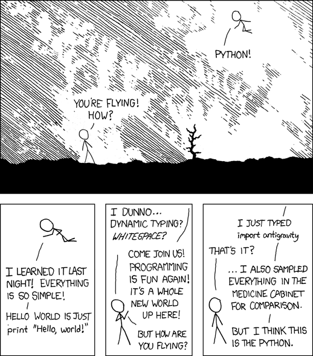

<h1 align="center"><i><strong>python-easter-eggs</i></h1>

_" A whimsical collection of hidden surprises, jokes, and quirky behaviors in Python. This README documents each “Easter egg” or language oddity with code examples, explanations, and outputs. Pull up a terminal, have some fun, and discover what makes Python a delightful, surprising language! "_

--------

Table of Contents

- [Zen of Python](#zen-of-python)
- [Antigravity Comic](#antigravity-comic)
- [Antigravity geohash](#antigravity-geohash)
- [Braces](#braces)
- [Hello, World! Module](#hello-world-module)
- [Phello World Module](#phello-world-module)
- [ROT13 Cipher](#rot13-cipher)
- [Barry as FLUFL](#barry-as-flufl-friendly-language-uncle-for-life)
- [Mutable Default Arguments](#mutable-default-arguments)
- [Floating-Point Precision](#floating-point-precision)
- [Chained Comparisons](#chained-comparisons)
- [Small Integer Caching](#small-integer-caching)
- [String Interning](#string-interning)
- [PEG parser Easter Egg (Python 3.9 only)](#peg-parser-easter-egg-python-39-only)
- [types.CodeType help message](#typescodetype-help-message)
- [Infinity hash (InPynite)](#infinity-hash-inpynite)
- [NaN Is Not Equal to Itself](#nan-is-not-equal-to-itself)

--------

## Zen of Python

```python
>>> import this
```

Running this prints The **Zen of Python** – a collection of 19 aphorisms that capture Python’s design philosophy (PEP 20). For example, you’ll see lines like *“Beautiful is better than ugly”*, *“Explicit is better than implicit”*, and *“There should be one–and preferably only one–obvious way to do it.”* (Tim Peters left a “20th aphorism” blank for Guido van Rossum to fill in.)

### Expected output (abridged):

```txt
The Zen of Python, by Tim Peters
Beautiful is better than ugly.
Explicit is better than implicit.
... (17 more lines) ...
```

The Zen can always be summoned with `import this`. It even winks at Guido’s Dutch heritage with *“Although that way may not be obvious at first unless you’re Dutch”*, a sly reference to Python’s creator.

--------

## Antigravity Comic

<p align="center"></p>

*Importing this module honors the famous XKCD “Python” comic.*

```python
>>> import antigravity
```

This is Python’s nod to humor: importing the `antigravity` module launches your web browser to the classic XKCD comic #353, where a Python user literally flies using `import antigravity`. It does **nothing in code** except open the comic – no gravity defiance happens in the interpreter. It’s a fun reminder that Python doesn’t take itself too seriously.

**Expected effect:** Your default browser opens to an XKCD page (the comic about Python and flying). Nothing is printed in the console.

--------

## Antigravity geohash

Beyond the famous import antigravity (which opens an XKCD comic), there is a geohashing function in the same module.

#### For example:

```python
>>> from antigravity import geohash
>>> geohash(37.421542, -122.085589, b'2005-05-26-10458.68')
```

This uses the XKCD “geohashing” algorithm to compute a latitude/longitude from your location and a date+stock index seed. In this case it outputs a random nearby coordinate. It’s a whimsical hidden feature — the module name hints at XKCD, and the geohash function is a playful extra import that generates a “treasure hunt” location.

### Expected output:

```python
37.857713 -122.544543
```

--------

## Braces

```python
>>> from __future__ import braces
```

Typing this familiar-looking line produces a cheeky **SyntaxError**: *“not a chance”*. In other words, you cannot use `{ }` to delimit blocks in Python; its indentation-based syntax will never support braces. This is an intentional Easter egg – a joke on those asking for curly-braced syntax. As one explanation notes, it’s Python’s way of saying your chances of enabling braces are nil.

### Expected output (error):

```python
File "<stdin>", line 1
    from __future__ import braces
SyntaxError: not a chance
```
Here the interpreter is literally *“not a chance”* willing to change its core design! This joke is often mentioned alongside other in-jokes like `import this` and `import antigravity`.

--------

## Hello, World! Module

```python
>>> import __hello__
Hello world!
```

This cute module simply greets you. On import, `__hello__` prints `Hello world!` to the console (on Python 2 it said “Hello world…”). It’s the shortest way to print “Hello, world!” without calling `print()` yourself. (It’s named after the classic first program.) In fact, the variant `__phello__` does the same thing.

### Expected output:

```pyton
Hello world!
```

Both modules exist purely for fun and tests; there’s no deeper functionality. It’s just Python saying “Hi!” when you ask.

--------

## Phello World Module

```python
>>> import __phello__
Hello world!
```
`__phello__` is a playful riff on `__hello__`. It also prints `Hello world!` upon import. (Bonus: if you do from `__phello__` `import spam`, you’ll get *“Hello world!”* twice.) In short, this module exists only as a lighthearted Easter egg and has no special purpose beyond the greeting.

### Expected output:

```python
Hello world!
```

--------

## ROT13 Cipher

```python
>>> import codecs
>>> print(codecs.encode("Hello, Python!", "rot-13"))
```

This uses the ROT13 codec (a simple letter-substitution cipher) built into Python’s codecs library. Encoding text with rot-13 transforms each letter 13 places in the alphabet (A↔N, B↔O, etc.). 

#### For example:

```python
>>> print(codecs.encode("Hello, World!", "rot-13"))
```

### Expected output:

```python
Uryyb, Jbeyq!
```

(The example above prints `"Uryyb, Jbeyq!"`.) While not hidden, the ROT13 codec is a quirky part of the standard library often discovered as a fun trick. (It even appears inside the `this`module’s source to encrypt the Zen!)

--------

## Barry as FLUFL (Friendly Language Uncle For Life)

```python
>>> from __future__ import barry_as_FLUFL
>>> 1 <> 2
True
>>> 1 != 2
```

This tongue-in-cheek future import (PEP 401) reactivates the old-school `<>` operator (diamond inequality) and makes `!=` illegal. In effect, after importing `barry_as_FLUFL`, only the `<>` syntax works for inequality. For example, `1 <> 2` will be `True`, while `1 != 2` triggers a syntax error. This was added as an April Fools’ joke: Uncle Barry (Barry Warsaw) insisted that `!=` was a “horrible, finger pain–inducing mistake,” so he brought back the diamond `<>` as the official operator.

### Expected output:

```python
True
SyntaxError: invalid syntax
```

(Where the SyntaxError corresponds to attempting to use != after the import.)

--------

## Mutable Default Arguments

```python
>>> def append_to(x, to=[]):
...     to.append(x)
...     return to
>>> print(append_to(1))
>>> print(append_to(2))
```

A classic Python gotcha: using a mutable default (like a list) means that the same object is reused across calls. In the example above, you might expect each call to start with a fresh list and print `[1]` then `[2]`. Instead, the first call prints `[1]`, and the second prints `[1, 2]` – the list was carried over. This happens because Python evaluates default argument values once at function definition time, not each call. Thus be careful: mutable defaults can lead to accumulating state in unexpected ways.

### Expected output:

```python
[1]
[1, 2]
```

This quirk often surprises newcomers; the fix is to use `None` and create a new list inside the function when needed.

--------

## Floating-Point Precision

```python
>>> print(0.1 + 0.2)
```

Python (like most languages) uses binary floating-point under the hood, which can’t exactly represent many decimal fractions. A famous example is `0.1 + 0.2`, which surprisingly outputs `0.30000000000000004` instead of exactly `0.3`. This isn’t a Python bug but a consequence of binary rounding. The interpreter prints the closest representable decimal, so you see the tiny rounding error.

### Expected output:

```python
0.30000000000000004
```

(It looks odd, but it’s exactly what many languages show. In Python 3’s repr, small inaccuracies are revealed like this.) Use formatting or round() if you need a clean decimal display.

--------

## Chained Comparisons

```python
>>> print(1 < 2 < 3)
>>> print(1 < 3 < 2)
```

Python allows chaining of comparisons in a very natural way: a < b < c is equivalent to (a < b) and (b < c), but with the middle term evaluated only once. In our example, 1 < 2 < 3 is True (since 1 < 2 and 2 < 3), whereas 1 < 3 < 2 is False (because 1 < 3 is true but 3 < 2 is false). This can make code more concise.

### Expected output:

```python
True
False
```

Chained comparisons work with any comparison operators (e.g. <, >, ==), allowing elegant expressions like 18 <= age <= 30[17]. Just remember, there’s no hidden relation between the first and last values beyond what’s stated (e.g. a < b > c checks a < b and b > c, not a < c).

--------

## Small Integer Caching

```python
>>> a = 256; b = 256
>>> print(a is b)
>>> a = 257; b = 257
>>> print(a is b)
```

CPython caches small integers (by default, all integers from -5 to 256) for performance. That means when you do a = 256 and b = 256, both names reference the same object, so a is b is True. But if you use an integer outside that range (e.g. 257), Python normally creates a new object each time. (In some interactive shells or environments you might see caching for larger ints too, but by specification the cache is up to 256.)

### Expected output:

```python
True
False
```

This can lead to the surprising fact that a is b may be True for small ints and False for larger ints, even if they have the same value.

--------

## String Interning

```python
>>> s1 = "hello"
>>> s2 = "hello"
>>> print(s1 is s2)
```

Python interns (reuses) many string literals for efficiency, especially short or common ones. In this example, s1 and s2 both point to the same interned string object, so s1 is s2 is True. In general, identical string literals in the same code will often be optimized this way. (Note: dynamic strings or longer strings may not always be interned unless you use sys.intern.)

## Expected output:

```python
True
```

String interning saves memory and allows fast comparisons. Just be aware that is works for string identity only because of this interning, not because is is the recommended way to compare string contents.

--------

## PEG parser Easter Egg (Python 3.9 only)
In Python 3.9 the new PEG parser was introduced, and a special symbol was added as an Easter egg. At the prompt, just typing `__peg_parser__` triggers:

```python
>>> __peg_parser__
    File "<stdin>", line 1
        __peg_parser__
        ^
SyntaxError: You found it!
```

In other words, the interpreter responds with `SyntaxError: You found it!`. This was an intentional surprise message added during the transition to the PEG-based grammar. It doesn’t exist in Python 3.8 (where it’s undefined) or in Python 3.10+ (where it’s removed). The cheeky error text confirms you’ve discovered the Easter egg marked by PEP 617 (the new parser PEP).

--------

## types.CodeType help message

If you inspect the help for types.CodeType (the built‑in code object type), you’ll find a playful warning.

#### For example:

```python
>>> import types
>>> help(types.CodeType)
Help on class code in module builtins:
    code(argcount, kwonlyargcount, nlocals, stacksize, flags, codestring,
         constants, names, varnames, filename, name, firstlineno, lnotab[, freevars[, cellvars]])
        Create a code object.  Not for the faint of heart.
```

In the generated documentation it explicitly says *“Not for the faint of heart.”* This humorous comment is a hidden Easter-egg–style warning buried in the help text for one of Python’s low-level types, implying that manually crafting code objects is advanced and *“not for the faint of heart.”*

--------

## Infinity hash (InPynite)

In CPython the hash of positive infinity is a fun number.

#### For example:

```python
>>> import math
>>> hash(float('inf'))
314159
>>> hash(float('-inf'))
-314159
```

The hash of inf is exactly `314159 (i.e. 10⁵ × π)` and -inf hashes to -314159. (In Python 2 the corresponding value was 271828, related to e.) This numeric Easter egg (“InPynite” pun) ties infinity to famous constants and surprises users who wonder why infinity hashes to what looks like part of π.

--------

## NaN Is Not Equal to Itself

```python
>>> x = float("nan")
>>> x == x
```

In Python, NaN (Not a Number) follows the IEEE-754 floating-point standard.
One of its most surprising rules is that NaN is not equal to anything — including itself.

This behavior exists to clearly signal undefined or invalid numeric results and to allow NaN values to safely propagate through calculations instead of silently producing wrong answers.

### Expected output:

```python
False
```

### NaN propagation

Once NaN appears, it spreads:

```python
>>> x + 10
nan

>>> x * 0
nan

>>> max(1, x)
nan
```

--------

***Notes & Trivia:*** Python’s playful culture is full of such references. For example, the language is named after Monty Python’s Flying Circus, not snakes. The Zen’s missing 20th line and the phrase “unless you’re Dutch” cheekily nod to Guido van Rossum. PEP 404 jokingly notes that “there will never be a Python 4”, cementing Python 3 as “the brand.” Enjoy sharing these Easter eggs – they’re a bit of Python lore that remind us the language is built by and for humans who love humor.

<p align="center">
  
</p>

--------

<h3 align="center">
  ⭐ IF YOU ENJOYED THIS COLLECTION, CONSIDER STARRING THE REPOSITORY! ⭐
</h3>

Your support helps keep the project alive and encourages more fun contributions!